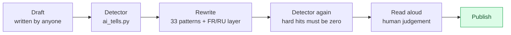

# humanizer-plus

An Agent Skill for Claude Code, OpenAI Codex, and any tool that supports the
Agent Skills spec. It strips **AI-writing tells** out of prose in **English,
French and Russian**, and then verifies the result with a **mechanical
detector**, so "it reads more human now" is a measurement rather than a hope.

Built on [blader/humanizer](https://github.com/blader/humanizer) (MIT), which
turns Wikipedia's [Signs of AI writing](https://en.wikipedia.org/wiki/Wikipedia:Signs_of_AI_writing)
into an editing prompt. That upstream skill is English-only and ends at the
rewrite. This one adds the other two languages, publisher typography rules, and
a checker.

## The loop at a glance



The detector never edits anything. It says where to look, the rewrite is
deliberate, and a person still signs it off.

## What it does

- Covers the **33 numbered patterns** from Wikipedia's guide: inflated
  significance, promotional register, fake depth on "-ing", vague attribution,
  rule of three, elegant variation, negative parallelism, chat residue,
  knowledge-cutoff disclaimers, filler, aphorism formulas, fake-candid openers.
- Adds a **French layer** ("dans un monde où", "force est de constater",
  véritable / incontournable / au cœur de, "non seulement... mais aussi") and a
  **Russian layer** («в современном мире», «играет ключевую роль»,
  «не только... но и», bureaucratese), including what is **not** a tell:
  French guillemets, the space before `: ; ! ?`, and the politeness formulas an
  administrative letter requires.
- Enforces **publisher typography** that upstream leaves optional: no em or en
  dashes anywhere public, no full stop at the end of a heading or a call to
  action, one spelling standard, no tool names in public copy.
- Ships a **zero-dependency detector**: about 30 rule families across the three
  languages, hard and soft severities, tell density per 1000 words, exit code 1
  on hard hits so it can gate a deploy.
- Keeps the hard rule that makes the difference between editing and lying:
  **the rewrite may not contain a fact, name, number, date or citation that was
  not in the source.** A fabricated fact is a defect even when it reads better.

## The detector

```bash
python scripts/ai_tells.py <file or folder> [--lang en|fr|ru|auto] [--all] [--internal] [--json]
```

```
== article.md [en] 940 words: review
   hard: 3  soft: 11  triplets: 4  density: 21.3 per 1000 words
   ! article.md:12 Title Case heading: '## Strategic Negotiations And Global Partnerships'
   ! article.md:31 em or en dash: '—'
   ! article.md:58 announcing instead of doing: "Let's dive"
```

Read-only, no dependencies, nothing leaves the machine. It understands Markdown
and HTML: in HTML it reads the visible text plus `alt`, `title` and meta
`content`, because those are public too, while code, frontmatter, links and
quotations are skipped so it does not complain about them. `--internal` relaxes
typography for working notes.

On test material the split is clean: generated slop scores above 250 tells per
1000 words in all three languages, edited human prose scores zero.

## Install

Copy or link this folder into your agent's skills directory:

```bash
# Claude Code
cp -r humanizer-plus ~/.claude/skills/
# OpenAI Codex
cp -r humanizer-plus ~/.codex/skills/
```

Start a new session and ask the agent to use `humanizer-plus`, or let it pick
the skill up when the task is "clean this text before it goes out".

Run it **last**, after the skills that actually write the copy, and treat its
output as a recommendation for human review rather than permission to edit a
live site by itself.

## Structure

```
humanizer-plus/
├── SKILL.md                              # the skill (read first)
├── scripts/
│   └── ai_tells.py                       # the detector, zero dependencies
├── reference/
│   ├── upstream-humanizer-2.9.1.md       # blader/humanizer, unchanged, with before/after examples
│   └── LICENSE-blader-humanizer.txt      # upstream MIT licence
└── README.ru.md                          # plain-language explanation, in Russian
```

## Author and license

Created by **Maryna Skachek** (MariCleo Studio), 2026, on top of
[blader/humanizer](https://github.com/blader/humanizer) v2.9.1 by blader, used
and redistributed under the MIT License (see
`reference/LICENSE-blader-humanizer.txt`). This work is released under the MIT
License as well (see `LICENSE`).

The pattern catalogue itself comes from
[Wikipedia:Signs of AI writing](https://en.wikipedia.org/wiki/Wikipedia:Signs_of_AI_writing),
maintained by WikiProject AI Cleanup, and is worth reading in full.

Studio: [MariCleo Studio](https://maricleo-studio.vercel.app/)
